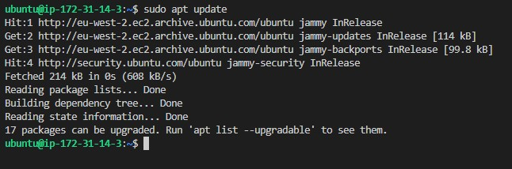
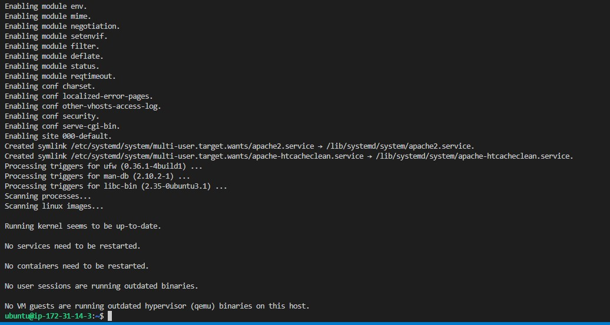
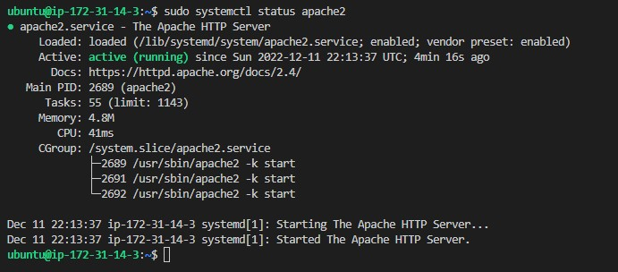
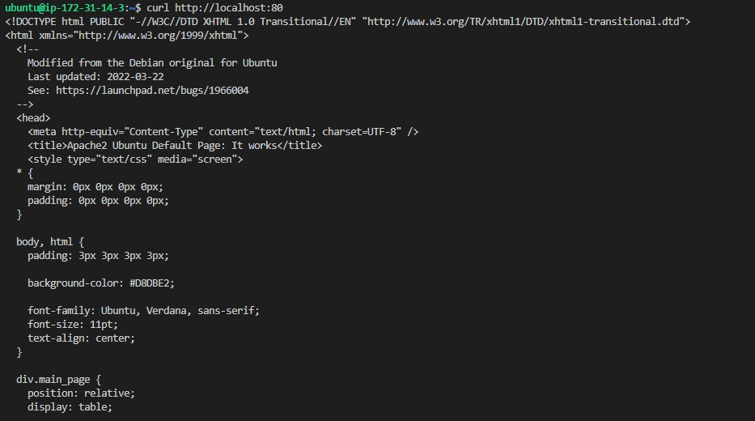
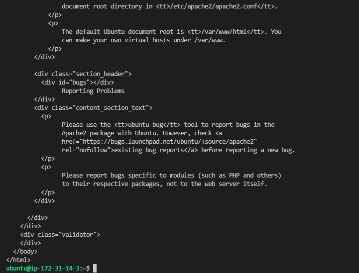
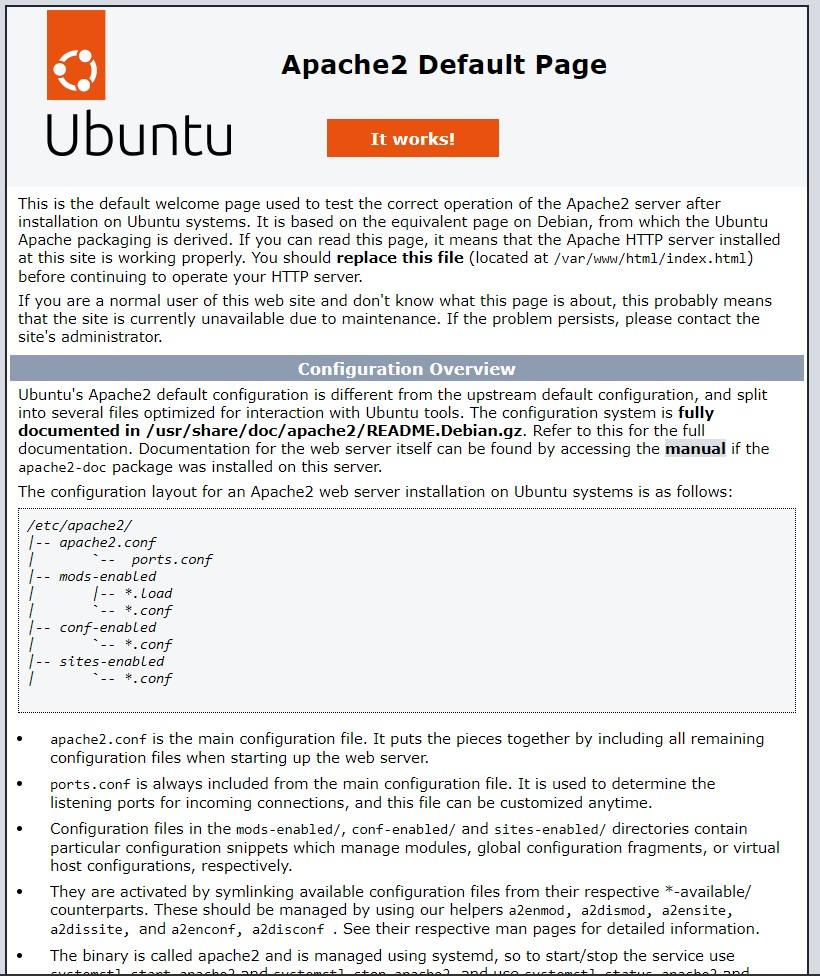

## INSTALLING APACHE AND UPDATING THE FIREWALL

## *installing apache web server with ubuntu package manage "apt"*

`To install apache server, I run command "sudo apt update" to update my server and the output in the image below was generated`

## *running apache installation*

`After updating the package, I run command "sudo apt install apache2" and the output in the image below was obtained`

`Command "sudo systemctl install apache2" was run to check if apache2 is running as a service in ubuntu. The output display in the image below was obtained.`

`I run curl http://localhost:80 to access apache server locally and the output below was generated`

`To test my apache server, I typed http://18.130.233.91:80 into my browser address bar and clicked enter, and the output in the image below was generated`

