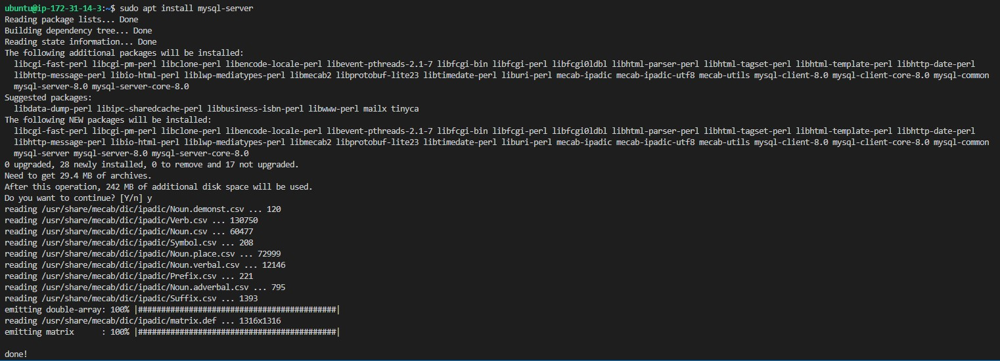

## INSTALLING APACHE AND UPDATING THE FIREWALL

## *installing apache web server with ubuntu package manage "apt"*

`To install apache server, I run command "sudo apt update" to update my server and the output in the image below was generated`


## *running apache installation*

`After updating the package, I run command "sudo apt install apache2" and the output in the image below was obtained`


`Command "sudo systemctl install apache2" was run to check if apache2 is running as a service in ubuntu. The output display in the image below was obtained.`


`I run curl http://localhost:80 to access apache server locally and the output below was generated`


`To test my apache server, I typed http://18.130.233.91:80 into my browser address bar and clicked enter, and the output in the image below was generated`


## INSTALLING MYSQL

`To install mysql, I run the command "sudo apt install mysql-server" and the output below was generated`




`After the installation, I logged into the mysql console with command "sudo mysql". The image below was downloaded as output`


## *mysql secure installation*

`To set security, I run an interactive script with command "sudo mysql_secure_installation" and the output generated was shown in the images below:`


`After the security settings, I tested mysql to check if it will allow me to login by running command "sudo mysql -p" and the ouptgenerate is shown in the image below`


## INSTALLING PHP

## *installing php package, php-mysql and php module*

`I installed the 3 packages with the command "sudo apt install php libapache2-mod-php php-mysql" and the output shown in the image below was generated`


`To know the version that was installed, I run command "php -v" and an output was generated as shown in the image below.`


## CREATING A VIRTUAL HOST FOR MY WEBSITE USING APACHE

## *creating directory for my website named lampstackproject*
`To create directory for my lampstackproject, I run command "sudo mkdir /var/www/lampstackproject"`

`I then run command "sudo chown -R $USER:$USER /var/www/lampstackproject" to assign ownership to the directory`

`I continue by running the command "sudo vi /etc/apache2/sites-available/lampstackproject.conf" in order to create and open new configuration file in apache's sites-available`

`I entered the code below into the output of the previous command to creat new blank file`

```
{<VirtualHost *:80>
    ServerName lampstackproject
    ServerAlias www.lampstackproject 
    ServerAdmin webmaster@localhost
    DocumentRoot /var/www/lampstackproject
    ErrorLog ${APACHE_LOG_DIR}/error.log
    CustomLog ${APACHE_LOG_DIR}/access.log combined
</VirtualHost>}
```

`I then run command "sudo ls /etc/sites-available" to see the new file in the sites-available and got the output shown in the image below`


`To enable the new virtual host, I run command "sudo a2ensite lampstackproject" and I got the output below:`


`To disable default website, I run command sudo a2dissite 000-default`

`To be sure that my configuration has no syntax error, I run command sudo apache2ctl configtest and the output showed syntax OK`

`I finally run command sudo systemctl reload apache2 to effect all changes`

`I then browsed http://mypublicIP:80 on my browser and I got the output in the image below`


## ENABLE PHP ON THE WEBSITE

## *changing order of index.php*

`To change the order of index.php, I run the command "sudo vim /etc/apache2/mods-enabled/dir.conf`


